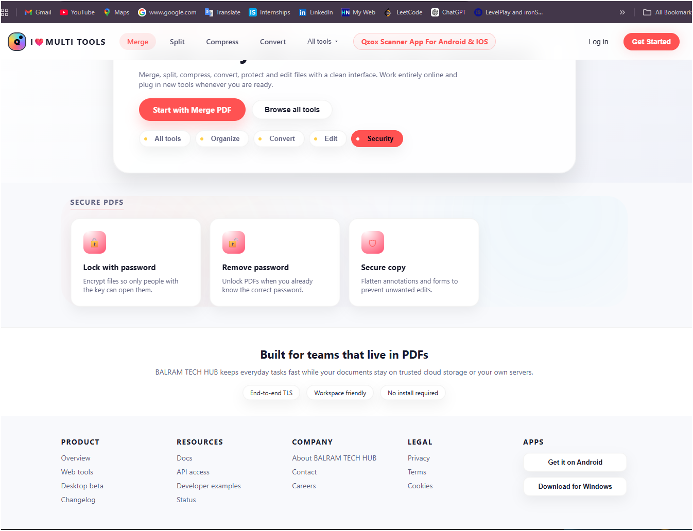

# 🎨 PDFCraft Frontend – Smart PDF Tools UI

## 🚀 Overview

This is the **frontend of PDFCraft**, a modern web application for performing multiple PDF operations like merge, split, compress, and convert.

The frontend is built using **HTML, CSS, and JavaScript**, providing a clean, responsive, and user-friendly interface that communicates with the backend APIs.

---

## 🌐 Live Demo

👉 ((https://ilovemultitool.netlify.app/))

---

## 🏗️ Tech Stack

* HTML5
* CSS3 (Modern UI / Responsive Design)
* JavaScript (Vanilla JS)
* REST API Integration

---

## ✨ Features

### 📂 PDF Tools UI

* Merge PDF
* Split PDF
* Compress PDF
* Convert Images to PDF

### ✏️ Editing Features

* Add watermark
* Page numbering
* Rotate pages

### 🔐 Security Features

* Add password protection
* Remove password
* Secure PDF copy

### 🧠 Smart UI

* Clean dashboard interface
* Categorized tools (Organize, Convert, Edit, Security)
* Smooth navigation

---

## 📸 Screenshots

### 🏠 Home Dashboard


### 📂 Tools Section


### ✏️ Editing UI


### 🔐 Security UI



---

## 📂 Project Structure

```id="f6x1qp"
/
 ├── index.html
 ├── style.css
 ├── script.js
 ├── assets/
 ├── screenshots/
```

---

## 🔌 API Integration

The frontend communicates with backend APIs for processing PDF operations.

Example:

```js id="x8q1pa"
fetch("https://your-backend.onrender.com/convert", {
  method: "POST",
  body: formData
})
```

---

## ⚙️ How to Run Locally

1️⃣ Clone the repository

```bash id="m3l9da"
git clone https://github.com/your-username/pdfcraft-frontend.git
```

2️⃣ Open project folder

3️⃣ Run using Live Server (VS Code)
OR simply open:

```id="b1x92m"
index.html
```

---

## ☁️ Deployment

You can deploy frontend easily on:

* Netlify
* Vercel
* GitHub Pages

---


## 🔥 Future Improvements

* Drag & Drop file upload
* Loading indicators
* Better animations
* Dark mode
* Mobile UI enhancements

---

## 👨‍💻 Author

Balram Singh

---

## ⭐ Note

This project demonstrates frontend development with real-world API integration, making it suitable for portfolio and production-ready applications.
